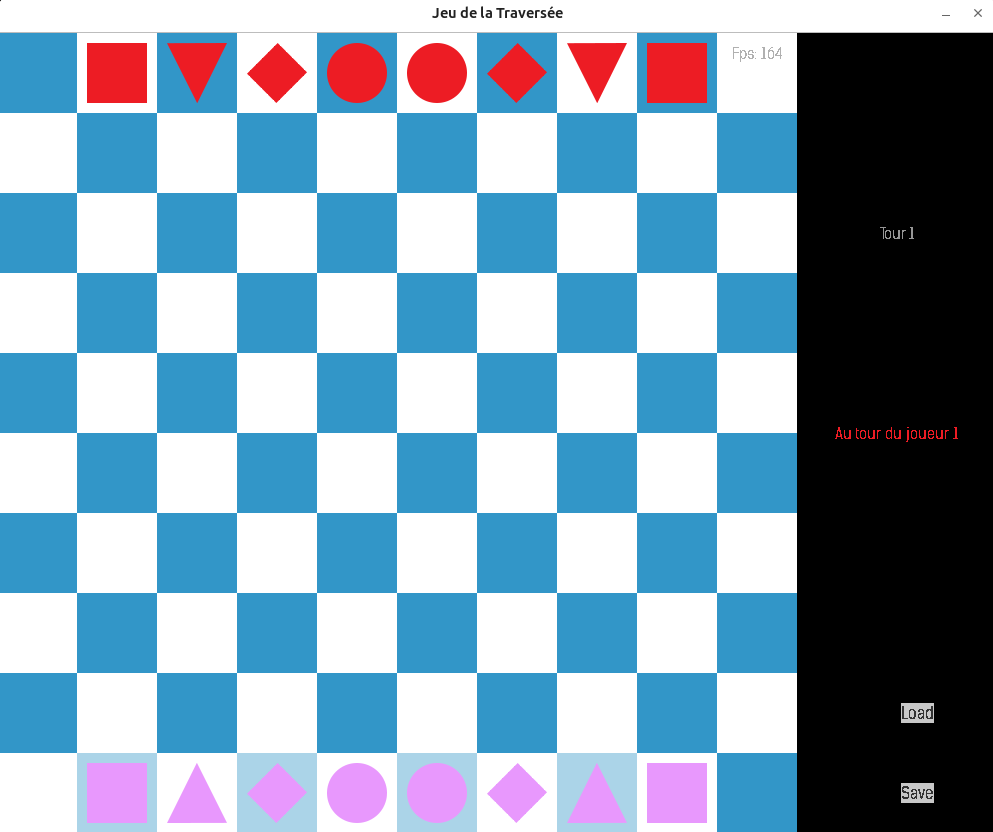

# Projet Traverse

Traverse est un jeu de plateau implémenté en C avec la bibliothèque graphique SDL2. Ce projet permet à des joueurs humains et des intelligences artificielles de s'affronter dans un environnement ludique et interactif.

## Règles du jeu

### But du jeu
Le but du jeu est de faire traverser tous ses pions de l'autre côté du plateau.

### Départ
Chaque joueur possède 8 pions :
- Les carrés se déplacent horizontalement et verticalement.
- Les losanges se déplacent en diagonale.
- Les triangles se déplacent en diagonale vers l'avant et tout droit vers l'arrière.
- Les cercles se déplacent dans toutes les directions.

### Déroulement d'une partie
Les joueurs jouent à tour de rôle, deux pions ne peuvent pas occuper la même case.
Les pions peuvent se déplacer d'une case ou sauter au-dessus d'un pion, sans le "manger".
Tous les pions restent donc jusqu'à la fin de la partie. Un pion ne peut pas finir son tour
sur une case en bordure mais peut transiter par une case en bordure s'il la quitte dans le
même tour.

### Fin du jeu
Le jeu se termine lorsque :
- L'un des joueurs a réussi à réunir tous ses pions dans la zone d'arrivée
  (la bordure opposée sans les coins), il est ainsi déclaré vainqueur.
- L'un des joueurs n'a pas libéré sa zone de départ après le 30e tour,
  il a alors perdu la partie.
- Un pion retourne à une même position 3 fois, la partie est déclarée nulle.

---

# Pour lancer le jeu

## Exécution en local

### Installer GCC

#### Sous Linux
GCC peut être installé via le gestionnaire de paquets. Ouvrez un terminal et exécutez :
```bash
sudo apt-get update
sudo apt-get install gcc
```

#### Sous Windows
Pour installer GCC sous Windows, vous pouvez utiliser MinGW. Suivez ces étapes :
1. Téléchargez MinGW depuis [le site officiel](http://mingw.org/).
2. Installez MinGW et lors de l'installation, assurez-vous de sélectionner `mingw32-base-bin` et `mingw32-gcc-g++-bin`.
3. Ajoutez le chemin du répertoire `bin` de MinGW à la variable d'environnement PATH.

### Installer les bibliothèques SDL2

#### Sous Linux
Exécutez les commandes suivantes pour installer SDL2 et ses extensions :
```bash
sudo apt-get install libsdl2-dev libsdl2-image-dev libsdl2-ttf-dev
```

#### Sous Windows
Installez les bibliothèques SDL2 en téléchargeant les fichiers de développement depuis les sites officiels et en configurant les chemins dans votre IDE ou environnement de développement.

### Compilation

Pour compiler le jeu, ouvrez un terminal ou une invite de commande dans le dossier du projet et tapez :
```bash
make all
```

### Utilisation

Lancez le jeu avec l'exécutable généré :
- Sous Linux : `./JeuTraverse`
- Sous Windows : Double-cliquez sur `JeuTraverse.exe`

Au lancement, sélectionnez le mode de jeu désiré.

---

## Exécution avec Docker

### Prérequis

Installer Docker :
- Linux : Suivre les instructions sur [docker.com](https://docs.docker.com/engine/install/).

### Construire l'image Docker

Dans le répertoire du projet, exécutez :
```bash
docker build -t jeutraverse .
```

### Exécuter le conteneur Docker

Autoriser l'accès à X11 :
```bash
xhost +local:docker
```

Lancer le conteneur :
```bash
docker run -it --rm -e DISPLAY=$DISPLAY -v /tmp/.X11-unix:/tmp/.X11-unix -v saves:/usr/src/traverse/saves --device /dev/dri:/dev/dri jeutraverse
```

Pour révoquer l'accès X11 après utilisation :
```bash
xhost -local:docker
```

## Utilisation du jeu

1. Au lancement du jeu, une fenêtre de dialogue énonce les règles du jeu.
2. Une seconde fenêtre s'affiche, demandant combien de joueurs humains vont participer.
3. Une troisième fenêtre demande le nombre de bots (ordinateurs) à ajouter.
4. Une fois les informations renseignées, la fenêtre principale s'affiche.
5. Le joueur peut interagir avec le jeu en cliquant sur les formes pour déplacer ses pions. Les déplacements possibles s'affichent et il suffit de cliquer sur une position valide pour effectuer un mouvement.
6. À tout moment, le joueur peut sauvegarder ou charger une partie en utilisant les boutons situés en bas à droite de l'application.
7. En fin de partie, le jeu propose de recommencer ou de quitter.


## Problèmes connus

- Lors d'une partie contre un bot, le jeu peut parfois planter. Ce problème est probablement dû à des inconsistances dans le langage utilisé, mais aucune erreur côté code n'a été identifiée.

## Rendu Visuel



# Repos source
Base: https://github.com/gwendalauphan/Jeu_Traverse_C.git


